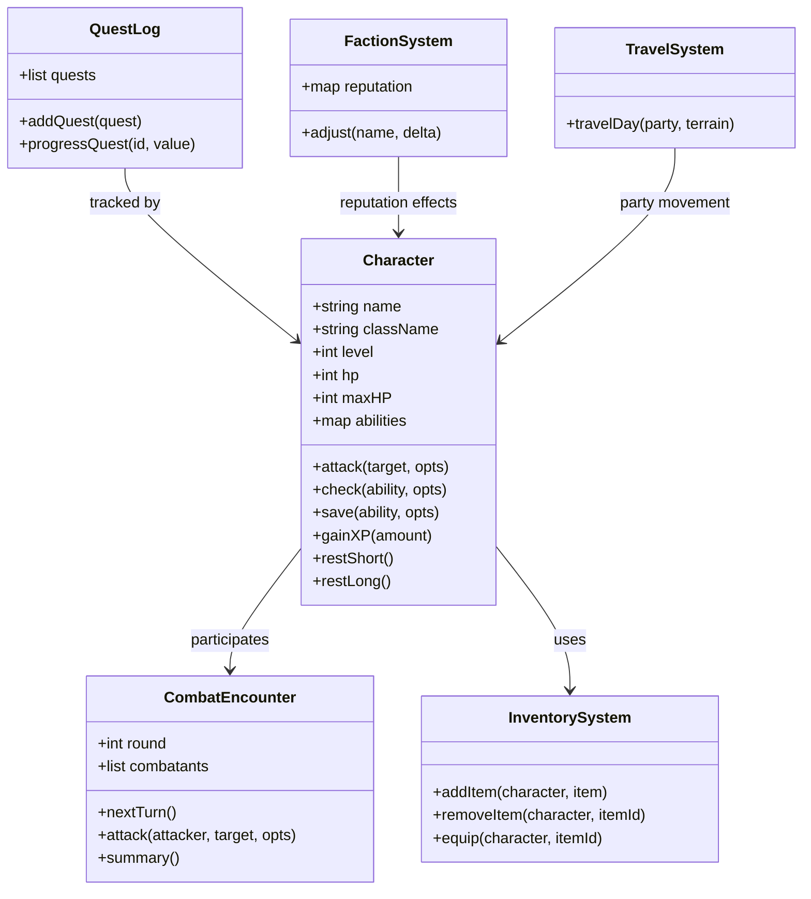

# UML Class Diagram

```mermaid
classDiagram
  class Character {
    +string name
    +string className
    +int level
    +int hp
    +int maxHP
    +map abilities
    +attack(target, opts)
    +check(ability, opts)
    +save(ability, opts)
    +gainXP(amount)
    +restShort()
    +restLong()
  }

  class CombatEncounter {
    +int round
    +list combatants
    +nextTurn()
    +attack(attacker, target, opts)
    +summary()
  }

  class InventorySystem {
    +addItem(character, item)
    +removeItem(character, itemId)
    +equip(character, itemId)
  }

  class QuestLog {
    +list quests
    +addQuest(quest)
    +progressQuest(id, value)
  }

  class FactionSystem {
    +map reputation
    +adjust(name, delta)
  }

  class TravelSystem {
    +travelDay(party, terrain)
  }

  Character --> CombatEncounter : participates
  Character --> InventorySystem : uses
  QuestLog --> Character : tracked by
  FactionSystem --> Character : reputation effects
  TravelSystem --> Character : party movement
```
