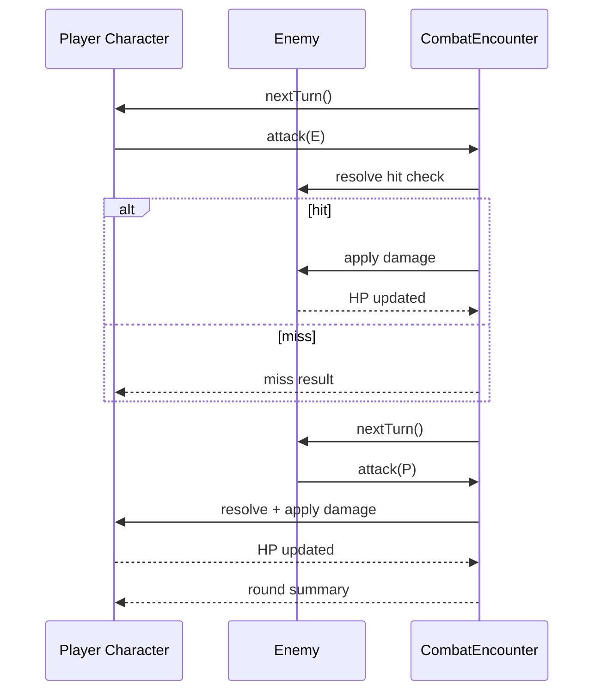

# UML Combat Sequence

```mermaid
sequenceDiagram
  participant P as Player Character
  participant E as Enemy
  participant C as CombatEncounter

  C->>P: nextTurn()
  P->>C: attack(E)
  C->>E: resolve hit check
  alt hit
    C->>E: apply damage
    E-->>C: HP updated
  else miss
    C-->>P: miss result
  end

  C->>E: nextTurn()
  E->>C: attack(P)
  C->>P: resolve + apply damage
  P-->>C: HP updated

  C-->>P: round summary
```
