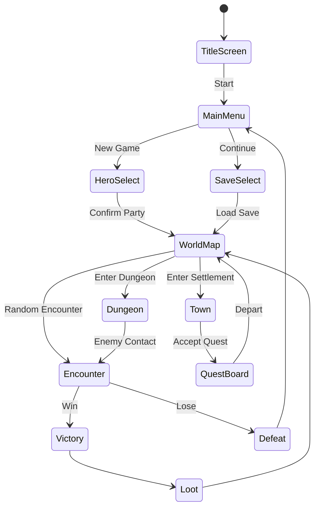

# UML State Flow

```mermaid
stateDiagram-v2
  [*] --> TitleScreen
  TitleScreen --> MainMenu : Start
  MainMenu --> HeroSelect : New Game
  MainMenu --> SaveSelect : Continue
  HeroSelect --> WorldMap : Confirm Party
  WorldMap --> Town : Enter Settlement
  WorldMap --> Dungeon : Enter Dungeon
  WorldMap --> Encounter : Random Encounter
  Town --> QuestBoard : Accept Quest
  QuestBoard --> WorldMap : Depart
  Dungeon --> Encounter : Enemy Contact
  Encounter --> Victory : Win
  Encounter --> Defeat : Lose
  Victory --> Loot
  Loot --> WorldMap
  Defeat --> MainMenu
  SaveSelect --> WorldMap : Load Save
```
