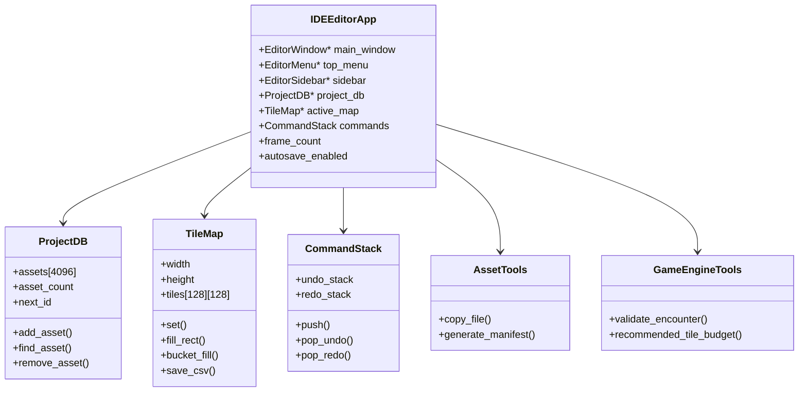

# UML Editor Architecture

```mermaid
classDiagram
  class IDEEditorApp {
    +EditorWindow* main_window
    +EditorMenu* top_menu
    +EditorSidebar* sidebar
    +ProjectDB* project_db
    +TileMap* active_map
    +CommandStack commands
    +frame_count
    +autosave_enabled
  }

  class ProjectDB {
    +assets[4096]
    +asset_count
    +next_id
    +add_asset()
    +find_asset()
    +remove_asset()
  }

  class TileMap {
    +width
    +height
    +tiles[128][128]
    +set()
    +fill_rect()
    +bucket_fill()
    +save_csv()
  }

  class CommandStack {
    +undo_stack
    +redo_stack
    +push()
    +pop_undo()
    +pop_redo()
  }

  class AssetTools {
    +copy_file()
    +generate_manifest()
  }

  class GameEngineTools {
    +validate_encounter()
    +recommended_tile_budget()
  }

  IDEEditorApp --> ProjectDB
  IDEEditorApp --> TileMap
  IDEEditorApp --> CommandStack
  IDEEditorApp --> AssetTools
  IDEEditorApp --> GameEngineTools
```
