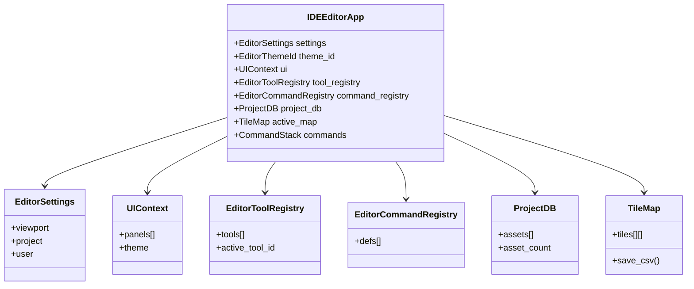

# UML Editor UI and Systems

```mermaid
classDiagram
  class IDEEditorApp {
    +EditorSettings settings
    +EditorThemeId theme_id
    +UIContext ui
    +EditorToolRegistry tool_registry
    +EditorCommandRegistry command_registry
    +ProjectDB project_db
    +TileMap active_map
    +CommandStack commands
  }

  class EditorSettings {
    +viewport
    +project
    +user
  }

  class UIContext {
    +panels[]
    +theme
  }

  class EditorToolRegistry {
    +tools[]
    +active_tool_id
  }

  class EditorCommandRegistry {
    +defs[]
  }

  class ProjectDB {
    +assets[]
    +asset_count
  }

  class TileMap {
    +tiles[][]
    +save_csv()
  }

  IDEEditorApp --> EditorSettings
  IDEEditorApp --> UIContext
  IDEEditorApp --> EditorToolRegistry
  IDEEditorApp --> EditorCommandRegistry
  IDEEditorApp --> ProjectDB
  IDEEditorApp --> TileMap
```
