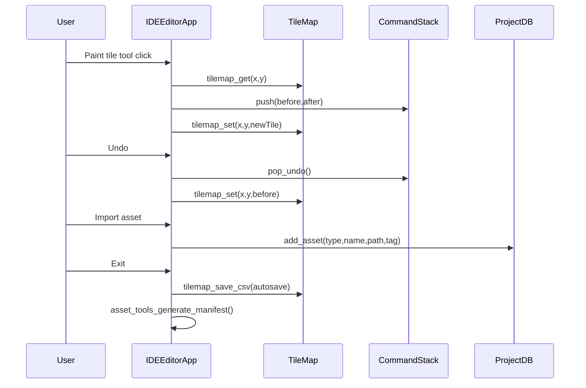

# UML Tool Sequence

```mermaid
sequenceDiagram
  participant User
  participant App as IDEEditorApp
  participant Map as TileMap
  participant Cmd as CommandStack
  participant DB as ProjectDB

  User->>App: Paint tile tool click
  App->>Map: tilemap_get(x,y)
  App->>Cmd: push(before,after)
  App->>Map: tilemap_set(x,y,newTile)

  User->>App: Undo
  App->>Cmd: pop_undo()
  App->>Map: tilemap_set(x,y,before)

  User->>App: Import asset
  App->>DB: add_asset(type,name,path,tag)

  User->>App: Exit
  App->>Map: tilemap_save_csv(autosave)
  App->>App: asset_tools_generate_manifest()
```
